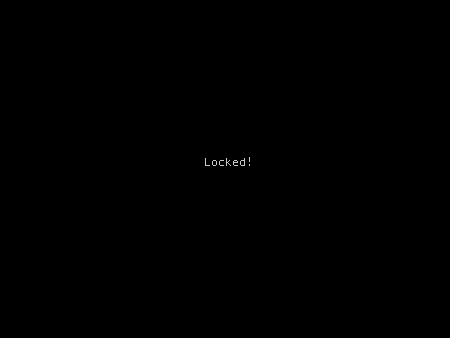

<h1 align="center">sock 🔒</h1>

<p align="center">a simple terminal locker</p>


## About

sock, or **S**imple L**ock** is a simple and customizable terminal locker.

## Usage

```
Usage: sock [OPTION]
A simple terminal locker

--help, -h: Display this information
--message=[STRING], -m: Set the message
--color=[HEX], -c: Set the color of the message
--bg=[HEX], -b: Set the color of the background
--og=[HEX], -o: Set the original color (only needed if you are using the '-e' option)
--escape, -e: Set the background color using escape seqences (check if your terminal supports this)
--center, -C: Center the text
--all, -a: Lock all terminals
--check, -k: Checks if all terminals are locked, if they are, it locks the terminal
```

## Setup

Add ```sock -k``` to your ```.shellrc``` so newly opened terminals can check if all terminals are locked

## Note

sock doesn't grab the current user's password from the system you must supply enter it into a prompt that doesn't echo your password.

## Dependencies

```
github.com/gdamore/tcell
```

```
github.com/spf13/pflag
```

```
github.com/bgentry/speakeasy
```
